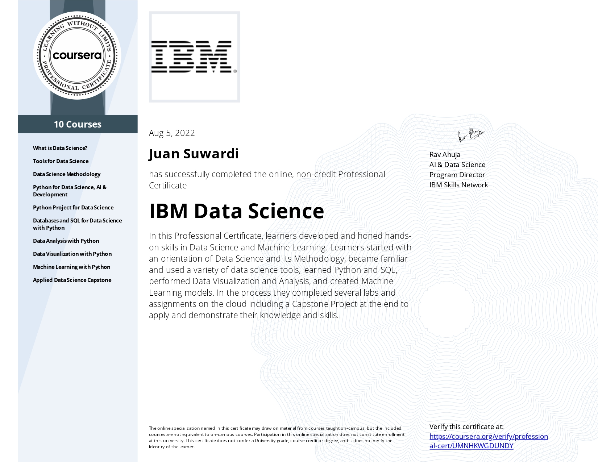

# IBM-Data-Science-Professional-Certificate

**STILL UNDER CONSTRUCTION**

This repository contain assignments about course IBM Data Science Professional Certificate. I hope this repository can help you.

## Table of Content
<!-- Module in Course -->

  
Module in Course

  <ol>
    <li><a href="#what-is-data-science?">What is Data Science?</a></li>
    <li><a href="#tools-for-data-science">Tools for Data Science</a></li>
    <li><a href="#data-science-methodology">Data Science Methodology</a></li>
    <li><a href="#python-for-data-science,-ai-&-development">Python for Data Science, AI & Development</a></li>
    <li><a href="#python-project-for-data-science">Python Project for Data Science</a></li>
    <li><a href="#databases-and-sql-for-data-science-with-python">Databases and SQL for Data Science with Python</a></li>
    <li><a href="#data-analysis-with-python">Data Analysis with Python</a></li>
    <li><a href="#data-visualization-with-python">Data Visualization with Python</a></li>
    <li><a href="#machine-learning-with-python">Machine Learning with Python</a></li>
    <li><a href="#applied-data-science-capstone">Applied Data Science Capstone</a></li>
  </ol>

## What is Data Science?
This module contain information about: 
* How to become data science and impact of cloud technologies on data science.
* Career path of data science.
* Skill for data scientist.

Link: **This module dont have notebook.**

---
## Tools for Data Science
This module contain information about: 
* Overview of the programming languages commonly used: Python, R, Scala, and SQL.
* Tools used in data science: GitHub, Jupyter Notebooks, and RStudio IDE.
* Enterprise-ready data science platform by IBM: Watson Studio.
* Module Final Assignment.

Link: https://github.com/Juantonios1/IBM-Data-Science-Professional-Certificate/tree/main/Tools%20for%20Data%20Science

---
## Data Science Methodology
This module contain information about:
* Methodology and flowchart of data science: CRISP-DM
* Understand data, and prepare or clean data.
* Model deployment.

Link: https://github.com/Juantonios1/IBM-Data-Science-Professional-Certificate/tree/main/Data%20Science%20Methodology

---
## Python for Data Science, AI & Development
This module contain information about:
* Basic pyhton: Types, expresions & variable, & string.
* Data structure: List tuples, dictionaries, sets.
* Python fundamental: If, loops, functions, exception handling, object & class.
* Read & writes, & python libraries: pandas, numpy.
* API & REST API

Link: https://github.com/Juantonios1/IBM-Data-Science-Professional-Certificate/tree/main/Python%20for%20Data%20Science%2C%20AI%20%26%20Development

---
## Python Project for Data Science
This module contain information about:
* Project for data scientist using python.

Link: https://github.com/Juantonios1/IBM-Data-Science-Professional-Certificate/tree/main/Python%20for%20Data%20Science%2C%20AI%20%26%20Development

---
## Databases and SQL for Data Science with Python
This module contain information about:
* Basic SQL.
* Relational database.
* Intermediate SQL.
* Acessing database using python.
* Module final assignment.
* Advanced SQL for data engineering.

Link: https://github.com/Juantonios1/IBM-Data-Science-Professional-Certificate/tree/main/Databases%20and%20SQL%20for%20Data%20Science%20with%20Python

---
## Data Analysis with Python
This module contain information about:
* Import dataset.
* Data wrangling.
* EDA.
* Model development.
* Model evaluation.
* Module final assignment.

Link: https://github.com/Juantonios1/IBM-Data-Science-Professional-Certificate/tree/main/Data%20Analysis%20with%20Python

---
## Data Visualization with Python
This module contain information about:
* Data visualization tools: Matplotlib.
* Area plot, histogram, bar charts, pie charts, boxplots, & scatter plot.
* Waffle charts, word cloud, seaborn, & Folium.
* Plotly & Dash.
* Module final assignment

Link: https://github.com/Juantonios1/IBM-Data-Science-Professional-Certificate/tree/main/Data%20Visualization%20with%20Python

---
## Machine Learning with Python
This module contain information about:
* Introduction to machine learning.
* Regression: linear regression & non-linear regression.
* Classification: KNN, DT, Logreg, & SVM.
* Clustering: K-means, hierarchical, & density-based (DBSCAN).
* Recommendation system: content based & collaborative.
* Module final project.

Link: https://github.com/Juantonios1/IBM-Data-Science-Professional-Certificate/tree/main/Machine%20Learning%20with%20Python

---
## Applied Data Science Capstone
* Collectiong data.
* EDA SQL, pandas, & matplotlib.
* Interactive visual analytics & dashboard
* Machine learning prediction.
* Presentation.

Link: https://github.com/Juantonios1/IBM-Data-Science-Professional-Certificate/tree/main/Applied%20Data%20Science%20Capstone

---
## Contributor
Juan Antonio Suwardi - antonio.juan.suwardi@gmail.com
